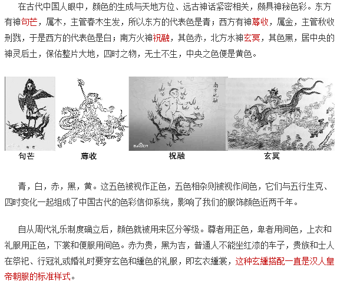
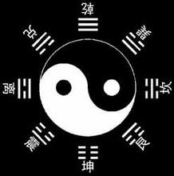

# 安满参考

## 四神

## 八卦

乾、坤、震、巽、坎、离、艮、兑

天、地、雷、风、水、火、山、泽

## 贤者

燚贤，万火之贤，掌握火温之力

侣贤，僧侣之贤，脱离俗世的贤者妖，拥有控制信仰程度的能力

弘贤，弘大之贤，拥有控制意义程度的能力

昌贤，盛世之贤，能改变社会现状，拥有掌握状况 的能力

虑贤，灵思之贤，拥有控制人思想方式的能力

权贤，权力之贤，曾接触过历代帝王的贤者妖，拥有掌握权力程度的能力

因贤，因果之贤，拥有控制两者关系的能力

择贤，抉择之贤，曾指示过大事业家的选择，拥有判断选择的能力

玷贤，玉玷之贤，拥有控制影响的能力

## 阴阳祇

外貌类似人形的神灵

右臂为“断绝阴暗的征臂”

左臂为“消除光明的衙臂”

右臂被“决灵袂”保护

左臂被“源河团”附体

头顶的“四棱帽”是用来控制自身的思维的

因为阴阳士是容易发狂的

实力与始祖灵不相上下

觉醒状态下是光与暗的融合体，可以吞噬黑洞和白洞

身边经常跟随者两个透灵

是来增强力量和恢复能力的

## 星宿

东青龙七宿：角木蛟　亢金龙　氐土貉　房日兔　心月狐　尾火虎　箕水豹
南朱雀七宿：井木犴　鬼金羊　柳土獐　星日马　张月鹿　翼火蛇　轸水蚓
西白虎七宿：奎木狼　娄金狗　胃土雉　昴日鸡　毕月乌　觜火猴　参水猿
北玄武七宿：斗木獬　牛金牛　女土蝠　虚日鼠　危月燕　室火猪　壁水獝

二十八宿，天元气，万物之精也。故

东方角、亢、氐、房、心、尾、箕七宿，其形如龙，曰‘左青龙’。
南方井、鬼、柳、星、张、翼、轸七宿，其形如鹑鸟，曰前朱雀
西方奎、娄、胃、昴、毕、觜、参七宿，其形如虎，曰右白虎
北方斗、牛、女、虚、危、室、壁七宿，其形如龟蛇，曰后玄武

二十八宿的名称，自西向东排列为：东方苍龙七宿(角、亢、氐、房、心、尾、箕)；北方玄武七宿(斗、牛、女、虚、危、室、壁)；西方白虎七宿(奎、娄、胃、昴、毕、觜、参)；南方朱雀七宿(井、鬼、柳、星、张、翼、轸）。

二十八宿从角宿开始，自西向东排列，与日、月视运动的方向相同：

东方称青龙：角木蛟、亢金龙、氐土貉、房日兔、心月狐、尾火虎、箕水豹；
南方称朱雀：井木犴、鬼金羊、柳土獐、星日马、张月鹿、翼火蛇、轸水蚓；
西方称白虎：奎木狼、娄金狗、胃土雉、昴日鸡、毕月乌、觜火猴、参水猿；
北方称玄武：斗木獬、牛金牛、女土蝠、虚日鼠、危月燕、室火猪、壁水貐。
